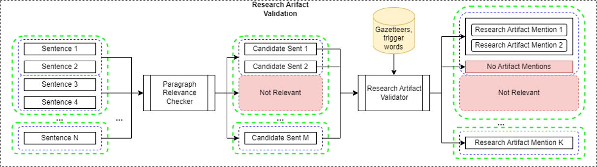
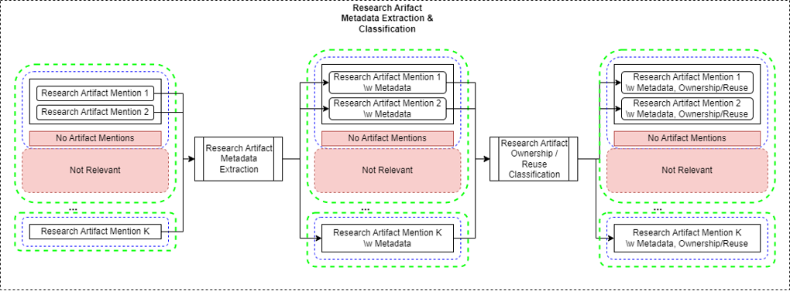
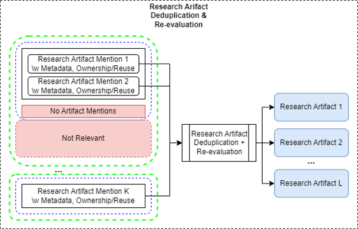

# Scinobo Research Artifact Analysis (RAA) tool
This repository contains the files for the SciNoBo Research Artifact Analysis (RAA) tool.

This tool performs RAA on scientific texts to extract mentions of **research artifacts (RAs)** (e.g. datasets, software) along with their metadata and then deduplicates these mentions to find the unique RAs that were referenced, (re)used or created in the text. It is based on finetuned LLMs and depends on a list of keywords/keyphrases/gazetteers to detect candidate mentions to RAs in the texts (source: default list of keywords for Computer Science and a default list of gazetteers from PapersWithCode).

The RAA system takes as input the structured text of the publication (sentences, paragraphs, sections with titles) and uses an **Instruction Fine-tuned Large Language Model (LLM)** and an opitionial **Coreference Resolution Longformer Model** in a structured pipeline setting to extract the RAs.

The pipeline consist of 3 stages:
 
1) <u>Research Artifact Validation</u>: 
 
Filters the sentences that contain research artifacts. 

This stage contains two sub-systems, which exploit the LLM model:
 
- <u><span>Paragraph Relevance Checker</span></u> -> Checks whether a paragraph contains any Research Artifacts.
 
- <u><span>Research Artifact Validator</span></u> -> Searches each candidate sentence for trigger words and validates whether each match is a valid Research Artifact Mention or a generic reference.



2) <u>Research Artifact Metadata Extraction & Classification</u>:
 
Extracts metadata from the Research Artifact Mentions (e.g. Name, Version, License, URL, etc) and classifies the artifact in each mention as “owned” and “reused”. 

This stage contains two sub-systems, which exploit the LLM model:
- <u><span>Research Artifact Metadata Extraction</span></u> -> Extracts the metadata from each Research Artifact Mention (Name, Version, License, URL, Citations, etc).
- <u><span>Research Artifact Ownership/Reuse Classification</span></u> -> Classifies each Research Artifact Mention based on its “ownership” and “reuse” from the authors of the publication.



3) <u>Research Artifact Deduplication & Re-evaluation</u>:
 
Clusters the Research Artifacts Mentions, using their context and metadata to deduplicated Research Artifacts, and re-evaluates their metadata, as well as the “owned”, and “reused” classes based on the consolidated context of each Research Artifact.

This stage contains one sub-system, which exploits the Coreference Resolution Longformer model (if available):
 
- <u><span>Research Artifact Deduplication + Re-evaluation</span></u> -> Uses the paragraph context of each Research Artifact Mention, along with their metadata to cluster them into Research Artifacts. Then aggregates the metadata and contexts, and re-evaluates the “ownership” and “reuse” classification.



Current version uses the finetuned `Flan-T5 Base` model.

## Papers
- [Empowering Knowledge Discovery from Scientific Literature: A novel approach to Research Artifact Analysis](https://openreview.net/forum?id=inIpFkj0OL)

## Info

The server provides one functionality:

1. **Infer Text List**: This functionality allows you to infer the polarity, intent, and semantics of a single citance. The endpoint for this functionality is `/infer_text_list`. This expects a: `List[List[str]]`, the external list is the "document" with its paragraphs and the nested list are the "sentences" of each paragraph.

With bulk inference you can give input and output folders for any PDF or Text file.


## Docker Build and Run

To build the Docker image, use the following command:

```bash
docker build -t scinobo_raa .
```

To run the Docker container

### Server:
```bash
docker run --rm --gpus all -p 8000:8000 scinobo_raa uvicorn raa.server.api:app --host 0.0.0.0 --port 8000
```

This will serve the uvicorn server of `server.py` which supports the `/infer_text_list` endpoint.

### Bulk Inference for (Text, PDF, TEI XML or Parquet) files:
```bash
docker run -e GROBID_URL='https://kermitt2-grobid.hf.space' --rm --gpus all -p 8000:8000 -v /host/directory:/container/directory scinobo_raa python -m raa.pipeline.inference --input_dir /path/to/input/inside/container --output_dir /path/to/output/inside/container
```

Make sure that you specify paths inside the `/app/external` container directory, which is reserved for the bulk PDF input.

The `GROBID` module is used for PDF processing,. You can specify the GROBID url endpoint using the environment value `GROBID_URL` and the `-e` flag.

The `SciCo` model can be used to enable the use of coreference in deduplication (can be found in the [scico-api repository](https://github.com/iNoBo/scico-api). You can enable it specifying an address for the API using the environment value `SCICO_API_URL` and the `-e` flag.

Example:

```bash
docker run -e SCICO_API_URL='http://localhost:8088' -e GROBID_URL='https://kermitt2-grobid.hf.space' --rm --gpus all -p8000:8000 -v /my_path_to_folder/mypdfs:/app/external/input scinobo_raa python -m raa.pipeline.inference --input_dir /app/external/input/ --output_dir /app/external/output/
```

Other flags:
- `--input_dir`: Directory with PDF files to process.
- `--output_dir`: Output directory to save the results.
- `--filter_paragraphs`: Filter paragraphs to only include the ones with citations.
- `--perform_deduplication`: Perform deduplication of the mentions.
- `--insert_fast_mode_gazetteers`: Insert the fast mode gazetteers.
- `--dataset_gazetteers`: Type of dataset gazetteers to use (synthetic, hybrid)
- `--fast_mode`: Use the fast mode to extract research artifacts.
- `--text_mode`: Extract research artifacts from text files instead of pdfs.
- `--text_mode_split_sentences`: Split the text into sentences.
- `--reevaluate`: Reevaluate the results using new thresholds.
- `--reevaluate_only`: Only reevaluate the results using new thresholds, skipping the normal pipeline.
- `--thresholds`: Specify the thresholds for the re-evaluation. Should be a dict, valid keys are valid_score, ownership_score, and usage_score.
- `--verbose`: Verbose mode.
- `--parquet_mode`: Run the pipeline for parquet files instead of PDFs that contain the columns: "id", "sections".
- `--filter_input`: Wildcard pattern to filter input files to analyze.

## Conda

For conda use :

`conda run --no-capture-output -n docker_env python -m`

instead of:

`python -m`

in the above snippets.
